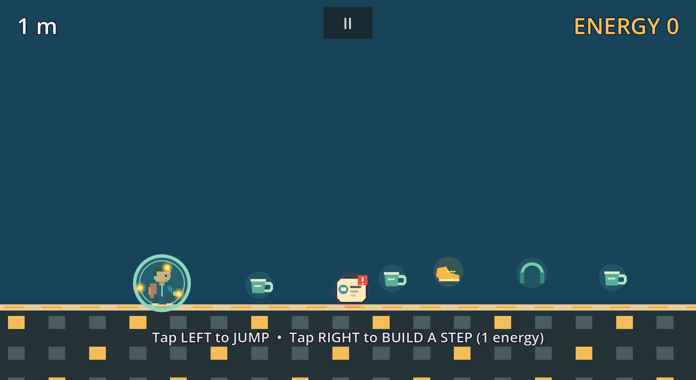

# Everyday Run

An endless runner-builder for phones: an auto-running commuter, one finger,
and an ordinary day that only stays on track because you build the next step.
Coffee restores energy, notifications get stomped, plans flip upside down,
friends help, and the workday eventually disappears into open space.



**Play it:** https://spellbros.neven.one (best on a phone, landscape)

Built in **Godot 4.7**, code-first: one scene ([scenes/main.tscn](scenes/main.tscn)),
every node created in GDScript, all art drawn in `_draw()`, all audio
procedurally synthesized. Zero asset files.

## How it plays

The commuter runs right on their own. You only decide when they jump and where
platforms appear:

- **Tap LEFT of the commuter → jump** (coyote time + input buffer make taps forgiving)
- **Tap RIGHT of the commuter → build a step** there (costs 1 energy)
- A tap clearly below the falling runner becomes a last-second built step,
  even inside the normal jump side of the screen
- The jump/build divider **never shrinks left of the runner's resting spot**
  (~22% from the left edge), so the jump zone survives even when the crush
  camera pushes them toward the edge
- Keyboard (PC convenience): **Space** jump, **R** restart, **P** pause

**Score** is distance in meters (100 px = 1 m). **You start with 0 energy** —
the opening teaches you to be greedy.

## Core systems

- **Energy economy** — coffee pickups are deliberately scarce: at most 2 entities
  (coffee + interruptions + pickups) per chunk, 3 after 300 m. Stomping an interruption
  pays **+1 energy**, so dismissing notifications is income.
- **Built steps** — 240×24 one-way note/crosswalk platforms. They crumble after
  **4.0 s** early game, shrinking to **2.4 s** between 300–600 m. Collision is
  full-size instantly, so a panic-build under your feet saves you.
- **Interruptions** — red notification badges sit still where they spawn;
  stomp from above kills them (and refreshes one jump until you land),
  any other touch kills you.
- **Crush camera** — the camera never waits. It holds a lead while you keep
  pace but keeps rolling (at 85% run speed) if you stall; fall behind the left
  screen edge and you die. Stalling to build stairs is a calculated risk.
- **Speed ramp** — 470 px/s base, +1.5 px/s per meter past 110 m, capped at
  900 px/s (~397 m). All normal gaps are sized as fractions of the *live* run
  speed so they stay jumpable at any speed (jump math is documented in
  [scripts/terrain_spawner.gd](scripts/terrain_spawner.gd)).
- **Camera framing** — 1.25× zoom (visible world 1536×864), runner at ~22%
  from the left edge, with a stable vertical frame that only lifts to reveal
  unusually high staircase set-pieces.

## Pickups

| Pickup | Looks | Where | Effect |
|---|---|---|---|
| Coffee | reusable mug; large takeaway cup for +3 | everywhere (scarce) | +1 or +3 energy |
| Double Jump | gold running shoe | from 50 m, on interruption-free decks | stores **one mid-air jump**; gold lights orbit you while held |
| Focus Mode | headphones | development grant / reserved pickup | absorbs one interruption |

## The day — same mechanics, everyday presentation

Under the themed day, terrain is still generated chunk by chunk and difficulty
gates on **where the chunk sits in meters** (never on player distance — chunks
spawn ~27 m ahead). It opens with a safe runway and two coffee pickups, then:

| Meters | Phase | What changes |
|---|---|---|
| 0–25 | warm-up | plain gaps, all jumpable |
| 25 | BUILD | **mega gaps** appear — wider than any jump and requiring one built step; coffee marks the opportunity |
| 50 | INTERRUPTIONS | notification badges and Double Jump pickups start appearing |
| 85 | CLIMB | **climb waves** rise beyond jump height; each step needs a build and pays coffee more reliably |
| 110 | SPEED | run speed starts ramping (+1.5 px/s per meter) |
| 170 | SWARM | 2 interruptions per wide chunk; mega gaps can **chain into doubles** (45%) |
| 300 | RICH | entity budget 2 → 3 and built steps begin crumbling faster |

| Meters | Part of the day | Existing mechanic |
|---|---|---|
| 0 | Morning Rush | original foundations, gaps, stairs, and speed ramp |
| 300 | Commute | every built step becomes a green launch pad |
| 600 | Notifications | chains of notification badges become stomp bridges |
| 900 | Change of Plans | taps flip gravity between floor and ceiling routes |
| 1200 | Night Walk | the city goes dark; coffee and built steps provide light |
| 1500 | Friends | a contact avatar can dismiss one lethal interruption for 1 energy |
| 1800 | Off the Clock | ground vanishes into the original open-space endgame |

The headless test suite audits every phase band for **beatability**: 80 sampled
chunks per band, every gap checked against the jump-reach math, zero unbeatable
chunks tolerated.

## Visual and audio pass with Codex + GPT-5.6

The complete gameplay implementation on the `levels` branch was preserved:
movement, controls, procedural generation, collision, difficulty, economy,
level boundaries, persistence, and tests are unchanged. On the `Codex` branch,
GPT-5.6 in Codex was used specifically for the presentation pass:

- redrew the wizard as a commuter with a backpack, phone, jacket, and sneakers;
- turned terrain into windowed city blocks and built platforms into temporary
  notes/crosswalks;
- changed crystals, stars, shields, blobs, and the helper into coffee, a
  running shoe, headphones, notification badges, and a contact avatar;
- replaced the cycling psychedelic palette with morning, workday, sunset,
  night-walk, and evening city colors while preserving the darkness mechanic;
- synthesized a new eight-bar 112 BPM lo-fi city groove plus new jump, coffee,
  build, notification, failure, and launch sounds entirely in code;
- updated the HUD, level names, application icon, and project copy; and
- kept the original smoke/beatability suite green after the reskin.

The shipped game has no AI runtime and needs no network or API credits; Codex
and GPT-5.6 were development tools used to create this new presentation layer.

## Development

```powershell
# run the game
godot --path "C:\Dev\spellbros_mobile"

# headless smoke test — the only automated verification
godot --headless --path . -s res://tests/smoke_test.gd

# after adding a new class_name script
godot --headless --path . --import

# deploy to https://spellbros.neven.one (exports Web preset, uploads via cPanel API)
powershell -File deploy.ps1
```

- [scripts/main.gd](scripts/main.gd) — game manager: input routing, camera, speed/platform tuning
- [scripts/player.gd](scripts/player.gd) — commuter physics and code-drawn character
- [scripts/terrain_spawner.gd](scripts/terrain_spawner.gd) — all phases, gap math, entity budget
- [scripts/hud.gd](scripts/hud.gd), [scripts/audio.gd](scripts/audio.gd) — HUD; synthesized SFX + music
- [tests/smoke_test.gd](tests/smoke_test.gd) — feature tests + difficulty/beatability audit

The **web build** is single-threaded (no COOP/COEP headers needed anywhere),
shows a rotate-your-phone overlay in portrait, and locks fullscreen landscape
on first tap where the browser allows it. An Android APK deploy (Pixel 8 Pro,
direct install) is planned; export templates are already installed.
